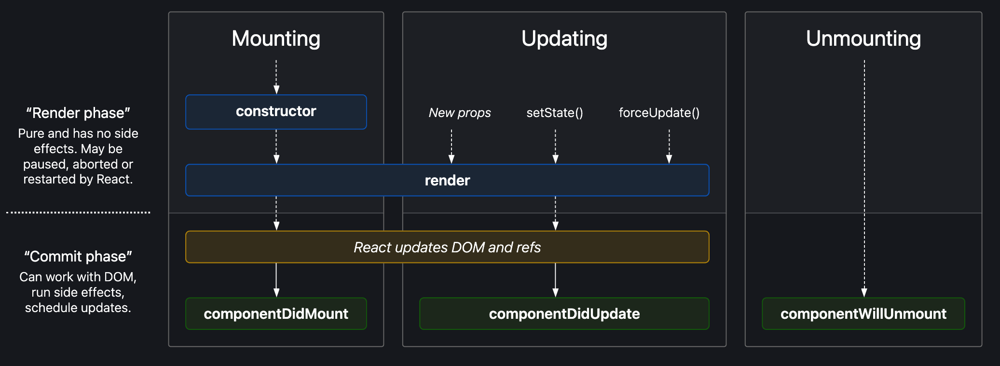
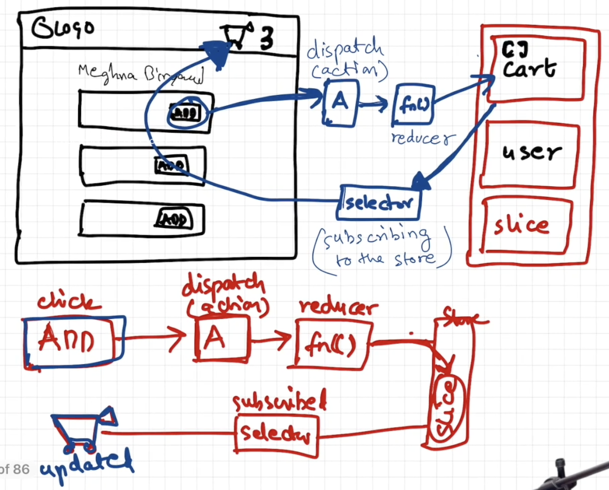

# Learning React 🚀
## Episode-1: Inception
### What this Episode-1: Inception all about
Introduction to foundational tools and frameworks in web development.

### Topics Covered:
- Visual code setup,
- Hello world in HTML/JS,
- CDN, React Hello World

### Brief summary about what we have done:
- Created a folder called `namaste-react`, which is an empty folder
- Created a simple HTML file which displays `Hello World!`. Using Emmet like simply using `html:5` to generate basic HTML file.
- We have written JS in the same HTML file to display the message, Instead of displaying by directly adding the content in HTML.
- Trying to add React to the project. For that we have added two lines from the `CDN React`.
- Why we are adding react-dom along with react in our project?
    - react-dom => react document object model
    - React doesn't work only on browsers. It works on different platforms as well.
    - This react-dom is like a bridge between the core react and browser.
- We have added React code to print the "Hello World!" message.
- After that we have seperated the React script into a seperate "App.js" file and included this file in the "index.html" file using 'script' tag.
- After that we have added CSS to the things in "index.css" file.

### Theory
#### Q: What is `Emmet`?

A: `Emmet` is the essential toolkit for web-developers. It allows you to `type shortcuts` that are then expanded into full pieces of code for writing `HTML and CSS`, based on an abbreviation structure most developers already use that expands into full-fledged HTML markup and CSS rules.

#### Q: What is `CDN`? Why do we use it?

A: A `content delivery network (CDN)` refers to a geographically distributed group of servers that work together to provide fast delivery of Internet content.
The goal is to provide high availability and performance by distributing the service spatially relative to end users.

#### Q: Why is `React known as React`?

A: And it's called `React` because it `reacts`. It was developed by Facebook (a site that CONSTANTLY updates their data) to improve the user interface development and more effectively change (REACT to) what the user sees when they're doing things like mouse clicking, submitting and typing.

#### Q: What is `crossorigin in script tag`?

A: The `crossorigin` attribute sets the mode of the request to an HTTP CORS Request.
The purpose of crossorigin attribute is used to share the resources from one domain to another domain. Basically, it is used to handle the CORS request. It is used to handle the CORS request that checks whether it is safe to allow for sharing the resources from other domains.

#### _Syntax_

```sh
<script crossorigin="anonymous|use-credentials">
```

#### Q: What is difference between `React and ReactDOM`?

A: `React` is a JavaScript library for building User Interfaces whereas `ReactDOM` is also JavaScript library that allows `React to interact with the DOM`.

The react package contains `React.createElement()`, `React.Component`, `React.Children`, and other helpers related to elements and component classes. You can think of these as the isomorphic or universal helpers that you need to build components. The react-dom package contains `ReactDOM.render()`, and in react-dom/server we have server-side rendering support with `ReactDOMServer.renderToString()` and `ReactDOMServer.renderToStaticMarkup()`.

#### Q: What is difference between `react.development.js` and `react.production.js` files via `CDN`?

A: `Development` is the stage of an application before it's made public while `production` is the term used for the same application when it's made `public`.
`Development build` is several times (maybe 3-5x) `slower` than the `production build`.

#### Q: What are `async and differ` attributes in `<script>` tag?

A: `Async` - The async attribute is a `boolean attribute`. The script is downloaded in `parallel(in the background)` to parsing the page, and `executed as soon` as it is available (do not block HTML DOM construction during downloading process) and don’t wait for anything.

#### _Syntax_

```
<script async src="demo_async.js"></script>
```

`Defer` - The defer attribute is a `boolean attribute`. The script is downloaded in `parallel(in the background)` to parsing the page, and `executed after the page` has finished parsing(when browser finished DOM construction). The `defer attribute` tells the browser `not to wait for the script`. Instead, the browser will continue to process the HTML, build DOM.

#### _Syntax_

```sh
<script defer src="demo_defer.js"></script>
```

#### Q: Difference between a `Library and Framework`?

A: A framework is a set of pre-written code that provides a structure for developing software applications. A library, on the other hand, is a collection of pre-written code that can be used to perform specific tasks.

A `library` is a collection of packages that perform specific operations whereas a `framework` contains the basic flow and architecture of an application. The major difference between them is the complexity. Libraries contain a number of methods that a developer can just call whenever they write code. React js is library and Angular is Framework.

The `framework` provides the flow of a software application and tells the developer what it needs and calls the code provided by the developer as required. If a `library` is used, the application calls the code from the library.

### Coding:
- Set up all the `tools in your laptop`
  - `VS Code`
  - `Chrome`
  - `Extensions of Chrome`
- Create a `new Git repo`
- Build your `first Hello World` program using,
  - Using `just HTML`
  - Using `JS to manipulate the DOM`
  - Using `React`
    - use `CDN Links`
    - Create `an Element`
    - Create `nested React Elements`
    - Use `root.render`
- `Push code to Github` (Theory as well as code)
- Learn about `Arrow Functions` before the next class

### References
- [CDN](https://www.cloudflare.com/learning/cdn/what-is-a-cdn/#:~:text=A%20content%20delivery%20network%20(CDN)%20is%20a%20geographically%20distributed%20group,stylesheets%2C%20images%2C%20and%20videos)
- [crossorigin](https://developer.mozilla.org/en-US/docs/Web/HTML/Attributes/crossorigin)
- [__SECRET_INTERNALS_DO_NOT_USE_OR_YOU_WILL_BE_FIRED](https://legacy.reactjs.org/docs/faq-versioning.html)
- [createElement](https://beta.reactjs.org/apis/react/createElement)
- [async vs defer attributes in Javascript](https://www.youtube.com/watch?v=IrHmpdORLu8)


## Episode-2: Igniting Your App
### What this Episode-2: Igniting Your App all about
Dive into essential package managers and module bundlers for React projects.

### Topics Covered:
- npm, Parcel
- Node modules
- React app file structure

### Brief summary about what we have done:
- For igniting our app we are going to introduce `npm` to the project.
- What is npm?
    - `npm` is the world's largest Software Registry. The registry contains over 800,000 code packages. Open-source developers use `npm` to share software.
    - Generally people think `npm` stands for `node package manager`. But this is not the actual abbrevation for 'npm'.
- Using `npm init` command, we are trying to add 'npm' to our project. And it has added `pacakge.json` to our project.
- At first, The major important `bundler` package we are adding to our project. i.e, `Parcel`. There are many bundlers available in the market for example `webpack-dev`. We are installing `Parcel` by using command `npm install -D parcel`.
    - Why we are adding `-D`?
        - There are two kind of dependencies we can install. One is 'dev dependency' and the other one is 'normal dependency'.
        - This `-D` is for 'Dev dependency'
- After installing `parcel` it has added a nw file called `package-lock.json` to our project and the `parcel` along with the version added as a dependency in our `package.json` file. Along with this a new folder called `node_modules` folder has been added to our project. This `package-lock.json` consists the track of all the dependecies amd along with transitive dependencies. And this `node_modules` folder consists of the source of all the packages and its dependent packages.
- If you see the `parcel` version in `package.json` file you can observe a symbol like this `^` which is called as "Caret". So, this `^` means the parcel version automatically upgrades when there is a minor release. We can add `~` symbol also which is called as "Tilde", but when we added this the version automatically upgrades when there is a major release. So directly upgrading to major version creates lot of issues. So, it is not at all recommended.
- what is 'Transitive Dependency'?
    - When we add or install one package as a dependency. The package itself it is dependent on some other packages. And these packages will also get installed along with the main dependency. So, This dependency we can call as 'Transitive Dependency'
- We should not push `node_modules` into the git. As we don't want them to be dircetly in production. So we have created a `.gitignore` file and we list this 'node_modules' there.
- We should push `package.json` and `package-lock.json` into the git. Using these files we can re-create or re-generate all the `node_modules`. For this we can simply run the command `npm install`.
- For igniting our App. We are running one command that is `npx parcel index.html`. Where `parcel` is our `bundler` and `index.html` is the source file for our project. The `Parcel` basically created a server for us. And our App hosted at `localhost:1234`. And when running this `npx parcel index.html` command two folders `.parcel-cache` and `dist` are added to our project.
- `npm` is for installing the packages. And `npx` is for executing the installed packages.
- As of now we are using `CDN React` links in our project to get `react` and `react-dom`. But is not the recommended way. While using `CDN React` links we are making network calls everytime and which is a costly operation. Instead of this, We will install `react` and `react-dom` using `npm`. So that we can keep `react` and `react-dom` in our `node_modules`. So that we don't need to make network calls everytime.
- We installed `react` using the command `npm install react` and installed `react-dom` using `npm install react-dom`.
- Now, We can see `react` and `react-dom` in the dependencies list in `package.json`.
- Now, we are good to remove the `CDN React` links from the `index.html` file. But for making the things work we are importing `react` and `react-dom` in our `App.js` using the lines `import React from "react";` and 
`import ReactDOM from "react-dom";`.
- But while loading the page we are facing an error like `Browser scripts cannot have imports and exports`. For fixing this, We are modifying the below line from `<script src="App.js"></script>` to `<script type="module" src="App.js"></script>` in the `index.html` file. With this we are stating that `App.js` as not a normal browser script.
- We can see a `warning` in the developer console related to the importing of the react-dom directly from react-dom. For fixing this, We modified this from `import ReactDOM from "react-dom";` to `import ReactDOM from "react-dom/client";`.
- Creating a Prod build: Using command `npx parcel build index.html` we can create the Prod build. And while running this command we encounterd or may encounter an error related to the entry point. If you see while doing `npm init` we have given `App.js` as main. But now we are running `npx parcel build index.html`. So this raises a conflict. For fixing this we can simply remove 'main' and its calue from `package.json`. And after running the `npx parcel build index.html` command the builds will be created and stored in the `dist` folder. And the dev builds also used to store in this folder only.
- We don't need to push `.parcel-cache` and `dist` into git. So simply we can list these in `.gitignore` file. These folders also will be re-created or re-generated.
- for making our App compatible with the older or some browsers will add some configuration in `package.json`. Ex,
```
"browserslist": [
    "last <no.> chrome versions",
    "last <no.> firefox versions",
    etc
]
```
### Theory
#### Q: What is `npm`?

A: `npm` is the world's largest Software Registry. The registry contains over 800,000 code packages. Open-source developers use `npm` to share software.

npm is lots of things:

- `npm` is the package manager for Node.js. It was created in 2009 as an open source project to help JavaScript developers easily share packaged modules of code.

- The `npm` Registry is a public collection of packages of open-source code for` Node.js, front-end web apps, mobile apps, robots, routers`, and countless other needs of the JavaScript community.
- `npm` alternative is `yarn`

#### How to initialize `npm`?

```
npm init
```

`npm init -y` can be used to skip the setup step, `npm` takes care of it and creates the `package.json` json file automatically , but without configurations.

- `npm` is the command line client that allows developers to install and publish those packages.

#### Q: What is `Parcel/Webpack`? Why do we need it?

A: `Parcel` and `webpack` are the bundlers used mostly for `JavaScript` or `Typescript` code that helps you to `minify, clean, and make your code compact` so that it becomes easier to send a request or receive the response from the server when it usually takes you to transfer multiple files without using any bundler for loading the page of your application. Both of these bundlers substantially reduce the time it takes for the transfer of data and files to the server from the application. Along with that both bundlers parcel and webpack remove the unnecessary comments, new lines, any kind of block delimiters, and white spaces while the functionality of the code remains unchanged.

Use of `Parcel/Webpack`:
Module bundlers are the way to organize and combine many files of JavaScript code into one file. A JavaScript bundler can be used when your project becomes too large for a single file or when you're working with libraries that have multiple dependencies.

#### installation commands:

- Install:

```
npm install -D parcel
```

`-D` is used for development and as a development dependency.

- Parcel Commands :
  - For development build:
  ```
  npx parcel <entry_point>
  ```
  - For production build :
  ```
  npx parcel build <entry_point>
  ```

#### Q: Why is `.parcel-cache` folder?

A: `cache folder` (or `.parcel-cache in parcel v2`) stores information about your project when parcel builds it, so that when it rebuilds, it doesn't have to re-parse and re-analyze everything from scratch. It's a key reason why parcel can be so fast in development mode.

#### Q: What is `npx`?

A: `npx` stands for `Node Package eXecute`. It is simply an `npm` package runner. It allows developers to execute any Javascript Package available on the npm registry without even installing it. npx is installed automatically with npm version 5.2.

#### Q: What is difference between `dependencies vs devDependencies`?

A: `"dependencies"` : Packages required by your application in production. `"devDependencies"` : Packages that are only needed for local development and testing.

#### Q: What is Tree Shaking? in Parcel?

A: `Tree shaking`, also known as `dead code elimination`, is the practice of `removing unused code in your production build`. It's important to ship as little code to your end-users as possible. By statically analyzing our source code, we can determine what's not being used and exclude it from our final bundle.

#### Q: What is Hot Module Replacement?

A: `Hot Module Replacement (HMR)` exchanges, adds, or removes modules while an application is running, without a full reload. This can significantly speed up development in a few ways: Retain application state which is lost during a full reload. Save valuable development time by only updating what's changed.

#### Q: List down your favourite 5 superpowers of Parcel and describe any 3 of them in your own words.

#### Parcel features:

- Dev Build - parcel provides us develop build
- Local Server - parcel also provides us a local server, which can be used to see live changes in our application.
- HMR = Hot Module Replacement - exchanges, adds, or removes modules while an application is running, without a full reload

and some of more cool features of Parcel are:

- File Watching Algorithm - written in C++
- Caching - Faster Builds
- Image Optimization
- Minification
- Bundling
- Compress
- Consistent Hashing
- Code Splitting
- Differential Bundling - support older browsers
- Diagnostic
- Error Handling
- HTTPs
- Tree Shaking - remove unused code
- Different Build for dev and prod bundles

#### Q: What is `.gitignore`? What should we add and not add into it?

A: gitignore file tells Git which files to ignore when committing your project to the GitHub repository. gitignore is located in the root directory of your repo. / will ignore directories with the name.

In our code we shouldn't add the files, which we can re-generate in future e.g, `node_modules`, `dist` etc.

#### Q: What is the difference between `package.json` and `package-lock.json` files?

A: Both of these files have the same format, and perform similar functions in the root of a project. The difference is that `package-lock. json` cannot be published, and it will be ignored if found in any place other than the root project.

The package. json is used for more than dependencies - like defining project properties, description, author & license information, scripts, etc. The package-lock. json is solely used to lock dependencies to a specific version number.

#### Q: Why should I not modify `package-lock.json`?

A: It is a generated file and is not designed to be manually edited. Its purpose is to track the entire tree of dependencies (including dependencies of dependencies) and the exact version of each dependency. You should commit `package-lock.json` to your code repository

You should avoid updating the `package.json` manually since it could break the synchronization between `package.json` and `package-lock. json`.

#### Q: What is `node_modules`? Is it a good idea to push that on git?

A: The `node_modules` folder contains generated code. This is not code you've written and you should never make any updates to the files inside Node modules because there's a pretty good chance they'll get overwritten next time you install some modules.

It is better to not commit the `node_modules` folder, and instead add it to your `.gitignore` file.

Here are all the reasons why you shouldn't commit it: The node_modules folder has a massive size (up to Gigabytes). It is easy to recreate the node_modules folder via packages. json

#### Q: What is the `dist` folder?

A: The `/dist` stands for distributable. The /dist folder contains the minimized version of the source code. The code present in the /dist folder is actually the code which is used on production web applications.

Parcel's default directory for your output is named dist . The --dist-dir public tag defines the output folder for your production files and is named public to avoid confusion with the dist default directory.

#### Q: What is `browserlists`?

A: Browserslist defines and shares the list of target browsers between various frontend build tools.

### Coding:
In your existing project

- initialize `npm` into your repo
- install `react and `react-dom`
- remove CDN links of react
- install parcel
- ignite your app with `parcel`
- add script for "start" and "build" with parcel commands
- add `.gitignore` file
- add `browserlists`
- build a production version of your code using `parcel build`

### References:

- [Parcel Documentation](https://parceljs.org/docs/)
- [Parcel on Production](https://parceljs.org/features/production/)
- [Browserlists](https://browserslist.dev/)

## Episode-3: Laying The Foundation
### What this Episode-3: Laying The Foundation all about
Understanding JSX, React components, and their compositions.

### Topics Covered:
- `JSX`
- `React.createElement` vs `JSX`
- `Benefits of JSX`
- `Behind the Scenes of JSX`
- `Babel` & `parcel` role in JSX
- `Components`
- `Functional Components`
- `Composing Components`
- Class-based vs Functional components

### Brief summary about what we have done:
- As of now for running our App, We are running one command `npx parcel index.html`. So Instead of this we will be creating a script to run our App.
- We have added these below two lines under the `scripts`in `package.json`.
    - `"start": "parcel index.html"`
    - `"build": "parcel build index.html"`
- And by using `npm run start` we can run our App.
- And by using `npm run build` we can build (prod build) of our App.
- For `npm run start` we can use `npm start` as well. But for `npm run build` we have run as it is.
- Writing the simple 'Hello World!' message code using core react like `React.createElement` is not such simple. For writing the simple kind of code facebook developers introduced `JSX`. Generally people think `JSX` is a part of `React` but it is obviously not. We can create a large scale application using `core react` only and without using `JSX` but the code is not that much easy to understand and also not that much readable.
- `JSX` is a convention where we can merge `HTML` and `JS`.
- `JSX` is not a `HTML` inside `JS`. `JSX is a HTML 'like' syntax`. The `JSX` code looks like `const jsxHeading = <h1 id="heading">Namaste React using JSX</h1>`. This is the way we can create `React Element` using `JSX`.
- If you print `jsxHeading` in console you will see `JS Object` which is nothing but a `React Element`.
- If you see the above written `JSX` code, We can say that is not a `pure JS code` because it is not upto the `ES (ECMAScript)` standard.
- And if you try to print the constant which hols the `React Element` code that is `React.createElement` code and also the constant which holds the `JSX`. You can find both are same.
- Let me tell you why they both are same? The `JS Engine` doesn't understand `JSX`. So, The `JSX` code transpiled before it reaches the `JS Engine`. So, Who transpiled it? `Parcel` is transpiling. But `Parcel` itself it is not transpiling.`Babel` is transpiling the `JSX` to `React.createElement` code. `Babel` is a compiler for the next generation JavaScript. This `Babel` got installed in our project as a dependent package of `parcel`. You can find the `Babel` in `node_modules` folder.
- Simply `JSX => traspiled by Babel to => React.createElement (Core React) => React Element (JS Object) => HTML Element (rendered) (browser understandable)`. So, This JSX will be transpiled by Babel to React.createElement (Core React) and to React Element (JS Object) and to browser understable HTML Element.
- If you have to give attributes in `JSX` then we have to write it in camel case. For suppose in HTML there is a tag called `class` but while writing this tag in JSX we have to write like this `className`.
- If we are writing multiple lines in JSX we have to write them between the `paranthesis i.e, ()`. Then only `Babel` can understand where to start and where to end.
- `React Components` : There are two types of React Components.
    - 1. `Class Based Component`
    - 2. `Functional Component`
- The `Class Based Component` is an older way to write React Components. The `Functional Component` is a newer way to write React Components.
- `React Function Component` is nothing but the `JS Function`. The name of the component variable should starts with the `capital letter`. And this component returns some piece of `JSX` code.
- For rendering the component we need to write or call the component between `</>`. For example, `root.render(<FunctionalComponent />)` this is the way to render. And if you observe we are rendering React Elements like this `root.render(reactElement)`.
- Now we rendered the "Hello World!" message using React Functional Component.
- Suppose, If we want to include FirstComponent in OtherComponent. We have to call like this.
```
const FristComponent = () => (
    <h1 id="heading">Namaste React 🚀</h1>
);

const OtherComponent = () => (
    <div id="container">
        <FristComponent />
        <h1 className="heading">Namaste React Functional Component</h1>
    </div>
);
```
- Putting one component in another component like above is generally called as `Component Composition`.
- We can write JavaScript code inside the JSX code in between the `curly braces i.e, {}`. You can see the following code snippet
```
const data = 100;

const FirstComponent = () =>(
    {data}
    <h1 className="heading">Namaste React Functional Component</h1>;
);
```
- We can call or use the React Element inside the React Component using these `curly braces i.e, {}`.
```
const reactElement = () => (
    <h1 id="heading">Namaste React 🚀</h1>
);

const ReactComponent = () => (
    <div id="container">
        {reactElement}
        <h1 className="heading">Namaste React Functional Component</h1>
    </div>
);
```
-  And we can call or use the React Element inside the React Element also in the same way.
```
const reactElement = <h1 id="heading">Namaste React 🚀</h1>;

const reactSecondElement = (
    <div id="container">
        {reactElement}
        <h1 className="heading">Namaste React Functional Component</h1>
    </div>
);
```
- `Cross Side Scripting Attack` : Suppose we are fetching some data using an api in the code. And a attacker trying to send the malicious JS code through the api. So that the malicious code can be executed and Hacker can fetch all of our information and our data too. But `JSX` is having the super power to sanitize the data and then pass in. The `JSX` prevents the Cross Side Scripting Attack. In the below example we are doing the same scenario abd if you see the 'data' we are using inside the JSX code in the React Component. But as we mentioned before executing the 'data' the JSX will sanitize the data and prevents the Cross Side Scripting Attack (if any).
```
const data = api.getData();

const ReactComponent = () => (
    <div id="container">
        {data}
        <h1 className="heading">Namaste React Functional Component</h1>
    </div>
);
```
- These are the ways how can we call one react comoponent in another react component
    - `{ReactComponent()}`
    - `<ReactComponent />`
    - `<ReactComponent></ReactComponent>`

### Theory
#### Q: What is `JSX`?

A: JSX stands for JavaScript XML.
JSX allows us to write HTML elements in JavaScript and place them in the DOM without any createElement() and/or appendChild() methods.
JSX makes it easier to write and add HTML in React.
JSX converts HTML tags into react elements.

#### Example 1 using JSX:

```
const myElement = <h1>I Love JSX!</h1>;
const root = ReactDOM.createRoot(document.getElementById('root'));
root.render(myElement);
```

#### Example 2 Without JSX:

```
const myElement = React.createElement('h1', {}, 'I do not use JSX!');
const root = ReactDOM.createRoot(document.getElementById('root'));
root.render(myElement);
```

#### Q: Superpowers of `JSX`.

A: Using JSX, you can write markup inside Javascript, providing you with a superpower to write logic and markup of a component inside a single .jsx file. JSX is easy to maintain and debug.

#### Example

```
function greeting(user) {
//JSX
  return <h1>{user}, How are you!!!</h1>;
}
```

#### Q: Role of `type` attribute in script tag? What options can I use there?

A: The `type` attribute specifies the type of the script. The type attribute identifies the content between the `<script>` and `</script>` tags. It has a Default value which is “text/javascript”.

#### `type` attribute can be of the following types:

- `text/javascript` : It is the basic standard of writing javascript code inside the `<script>` tag.
  #### Syntax
  ```
  <script type="text/javascript"></script>
  ```
- `text/ecmascript` : this value indicates that the script is following the `EcmaScript` standards.
- `module`: This value tells the browser that the script is a module that can import or export other files or modules inside it.
- `text/babel` : This value indicates that the script is a babel type and required bable to transpile it.
- `text/typescript`: As the name suggest the script is written in `TypeScript`.

#### Q: `{TitleComponent}` vs `{<TitleComponent/>}` vs `{<TitleComponent></TitleComponent>}` in `JSX`.

A: The Difference is stated below:

- `{TitleComponent}`: This value describes the `TitleComponent` as a javascript expression or a variable.
  The `{}` can embed a javascript expression or a variable inside it.
- `<TitleComponent/>` : This value represents a Component that is basically returning Some JSX value. In simple terms `TitleComponent` a function that is returning a JSX value.
  A component is written inside the `{<  />}` expression.
- `<TitleComponent></TitleComponent>` : `<TitleComponent />` and `<TitleComponent></TitleComponent>` are equivalent only when `< TitleComponent />` has no child components. The opening and closing tags are created to include the child components.

#### Example

```
<TitleComponent>
    <FirstChildComponent />
    <SecondChildComponent />
    <ThirdChildComponent />
</TitleComponent>
```

#### if there are no child elements, then we can write

```
<TitleComponent />
```

### Coding:
- Create a `Nested header Element` using `React.createElement`(h1,h2,h3 inside a div with class "title")

  - Create the `same element using JSX`
  - Create a `functional component of the same with JSX`
  - `Pass attribute` into the tag in `JSX`
  - `Composition of Component` (Add a component inside another)
  - `{TitleComponent}` vs `{<TitleComponent/>}` vs `{<TitleComponent></TitleComponent>}` in JSX.

- Create a `Header Component` from scratch using `Functional Component` with JSX
  - Add a `Logo on Left`
  - Add a `search bar in middle`
  - Add `User icon on right`
  - Add `CSS to make it look nice`

### References:
- [Babel](https://babeljs.io/)
- [Attribute Type](https://developer.mozilla.org/en-US/docs/Web/HTML/Element/script#attr-type)
- [JS Modules](https://developer.mozilla.org/en-US/docs/Web/JavaScript/Guide/Modules)
- [Babel Playground](https://babeljs.io/repl#)
- [React without JSX](https://reactjs.org/docs/react-without-jsx.html)

## Episode-4: Talk Is Cheap, Show Me The Code!
### What this Episode-4: Talk Is Cheap, Show Me The Code! all about
Implementing React's core features, managing state, and working with UI data.

### Topics Covered:
React app building
props/state
function mapping

### Brief summary about what we have done:
- In this, we are going to create a "Food Ordering" App form scratch.
- Created a layout in the paper.
- List of all components based on the layout
    - Header
        - Logo
        - Nav items
    - Body
        - Search
        - Restaurant Container
            - Restaurant Cards
                - image
                - name
                - cuisine
                - rating
                - eta for delivery
    - Footer
        - Copyright
        - Links
        - Address
        - Contact
- Created Header, Attached CSS as well.
- Created a simple search
- Created Restaurant Cards. But added multiple in static data manner.
- For generating dynamic Restaurant Cards. We are introducing `props`.
- Passing a `prop` is like passing arguments to a function.
- Config Driven UI: Website driven by dynamic data.
- Created Dynamic Restaurant Cards.
- We re-organized the code and cleaned up the mess.
- And, For displaying more Restaurant Cards dynamically we are looping the restaurant data using `map` and we are returning Restaurant Cards with dynamic data.
- And fixed one warning we have observed in the console by giving a unique `key` to each and every Restaurant Card. example: `<ResCard key={restaurant.data.id} restaurantData={restaurantObject}/>)`.
- Whe we have to add `key` with some unique value? If we are not giving unique identification to the Restaurant Cards. And when one new restaurant is going to add then the react re-renders every Restaurant Card. And it takes some time and cost to do that. To avoid that re-rendering we are giving `key` with some unique value.
- Using `index` as a unique identifier is a very bad practice. And React official docs also says that to not to use `index` as unique identification. Because the order may change some times.

### Theory
#### Q: Is `JSX` mandatory for React?

A: `JSX` is an Extension Syntax that allows writing HTML and Javascript together easily in React and is used to create React elements. These elements are then rendered to the React DOM. Each JSX element is just to make use of React easy and for calling React.createElement(component, props, …children) with less work. So, anything that is done with JSX can also be done with just plain JavaScript. So `JSX` is not mandatory but is used for writing better and clean code instead of writing code using `React.CreateElement`.

#### Example of `JSX`

```
const sample = <h2>Greetings</h2>;
```

#### Q: Is `ES6` mandatory for React?

A: `ES6` is not mandatory for `React` but is highly recommendable. The latest projects created on React rely a lot on ES6. React uses ES6, and you should be familiar with some of the new features like: Classes, Arrow Functions, Variables(let, const).
ES6 stands for ECMAScript 6. ECMAScript was created to standardize JavaScript, and ES6 is the 6th version of ECMAScript, it was published in 2015.

#### Q: `{TitleComponent}` vs `{<TitleComponent/>}` vs `{<TitleComponent></TitleComponent>}` in `JSX`.

A: The Difference is stated below:

- `{TitleComponent}`: This value describes the `TitleComponent` as a javascript expression or a variable or React element.
  The `{}` can embed a javascript expression or a variable or React element inside it.
- `<TitleComponent/>` : This value represents a Component that is basically returning Some JSX value. In simple terms `TitleComponent` a function that is returning a JSX value. If component is written inside the `{<  />}` expression.
- `<TitleComponent></TitleComponent>` : `<TitleComponent />` and `<TitleComponent></TitleComponent>` are equivalent only when `< TitleComponent />` has no child components. The opening and closing tags are created to include the child components.

#### Example

```
<TitleComponent>
    <FirstChildComponent />
    <SecondChildComponent />
    <ThirdChildComponent />
</TitleComponent>
```

#### Q: How can I write `comments` in JSX?

A: JSX comments are written as follows:

- `{/*  */}` - for single or multiline comments

#### Example

```
{/* A JSX comment */}
{/*
  Multi
  line
  JSX
  comment
*/}
```

#### Q: What is `<React.Fragment></React.Fragment>` and `<></>`?

A: `<React.Fragment></React.Fragment>` is a feature in React that allows you to return multiple elements from a React component by allowing you to group a list of children without adding extra nodes to the DOM.
`<></>` is the shorthand tag for `React.Fragment`. The only difference between them is that the shorthand version does not support the key attribute.

#### Example

```
return (
        <React.Fragment>
            <Header />
            <Navigation />
            <Main />
            <Footer />
        </React.Fragment>
    );

return (
        <>
            <Header />
            <Navigation />
            <Main />
            <Footer />
        </>
    );
```

#### Q: What is `Reconciliation` in React?

A: `Reconciliation` is the process through which React updates the Browser DOM and makes React work faster. React use a `diffing algorithm` so that component updates are predictable and faster. React would first calculate the difference between the real DOM and the copy of DOM (Virtual DOM) when there's an update of components.
React stores a copy of Browser DOM which is called `Virtual DOM`. When we make changes or add data, React creates a new Virtual DOM and compares it with the previous one. Comparison is done by `Diffing Algorithm`.
React compares the Virtual DOM with Real DOM. It finds out the changed nodes and updates only the changed nodes in Real DOM leaving the rest nodes as it is. This process is called Reconciliation.

                                 (or)

Reconciliation is the process by which React updates the UI to reflect changes in the component state. The reconciliation algorithm is the set of rules that React uses to determine how to update the UI in the most efficient way possible. React uses a virtual DOM (Document Object Model) to update the UI.

#### Q: What is `React Fiber`?

A: React Fiber is a concept of ReactJS that is used to render a system faster, smoother and smarter.
The Fiber reconciler, which became the default reconciler for React 16 and above, is a complete rewrite of React’s reconciliation algorithm to solve some long-standing issues in React.
Because Fiber is asynchronous, React can:

- Pause, resume, and restart rendering work on components as new updates come in
- Reuse previously completed work and even abort it if not needed
- Split work into chunks and prioritize tasks based on importance

#### Q: Why do we need `keys` in React?

A: A `key` is a special attribute you need to include when creating lists of elements in React. Keys are used in React to identify which items in the list are changed, updated, or deleted. In other words, we can say that keys are unique Identifier used to give an identity to the elements in the lists.
Keys should be given to the elements within the array to give the elements a stable identity.

#### Example

```
<li key={0}>1</li>
<li key={1}>2</li>
<li key={2}>3</li>
```

#### Q: Can we use `index as keys` in React?

A: Yes, we can use the `index as keys`, but it is not considered as a good practice to use them because if the order of items may change. This can negatively impact performance and may cause issues with component state.
Keys are taken from each object which is being rendered. There might be a possibility that if we modify the incoming data react may render them in unusual order.

#### Q: What is `props in React`? Ways to.

A: props stands for properties. Props are arguments passed into React components. props are used in React to pass data from one component to another (from a parent component to a child component(s)). They are useful when you want the flow of data in your app to be dynamic.

#### Example

```
function App() {
  return (
    <div className="App">
      <Tool name="Chetan Nada" tool="Figma"/> // name and tool are props
    </div>
  )
}
```

#### Q: What is `Config Driven UI`?

A: `Config Driven UI` are based on the configurations of the data application receives. It is rather a good practice to use config driven UIs to make application for dynamic.
It is a very common & basic approach to interact with the User. It provides a generic interface to develop things which help your project scale well. It saves a lot of development time and effort.
A typical login form, common in most of the Apps. Most of these forms also get frequent updates as the requirements increase in terms of Form Validations, dropdown options,.. or design changes.

#### Q: Difference between `Virtual DOM` and `Real DOM`?

A: DOM stands for `Document Object Model`, which represents your application UI and whenever the changes are made in the application, this DOM gets updated and the user is able to visualize the changes. DOM is an interface that allows scripts to update the content, style, and structure of the document.

- `Virtual DOM`
  - The Virtual DOM is a light-weight abstraction of the DOM. You can think of it as a copy of the DOM, that can be updated without affecting the actual DOM. It has all the same properties as the real DOM object, but doesn’t have the ability to write to the screen like the real DOM.
  - Virtual DOM is just like a blueprint of a machine, can do the changes in the blueprint but those changes will not directly apply to the machine.
  - Reconciliation is a process to compare and keep in sync the two files (Real and Virtual DOM). Diffing algorithm is a technique of reconciliation which is used by React.
- `Real DOM`
  - The DOM represents the web page often called a document with a logical tree and each branch of the tree ends in a node and each node contains object programmers can modify the content of the document using a scripting language like javascript and the changes and updates to the dom are fast because of its tree-like structure but after changes, the updated element and its children have to be re-rendered to update the application UI so the re-rendering of the UI which make the dom slow all the UI components you need to be rendered for every dom update so real dom would render the entire list and not only those item that receives the update .

| `Real DOM`                                                       | `Virtual DOM`                                            |
| ---------------------------------------------------------------- | -------------------------------------------------------- |
| DOM manipulation is very expensive                               | DOM manipulation is very easy                            |
| There is too much memory wastage                                 | No memory wastage                                        |
| It updates Slow                                                  | It updates fast                                          |
| It can directly update HTML                                      | It can’t update HTML directly                            |
| Creates a new DOM if the element updates.                        | Update the JSX if the element update                     |
| It allows us to directly target any specific node (HTML element) | It can produce about 200,000 Virtual DOM Nodes / Second. |
| It represents the UI of your application                         | It is only a virtual representation of the DOM           |

### Coding:
- Build a `Food Ordering App`
  - Think of a `cool name` for your app
  - Build an `AppLayout`
  - Build a `Header Component` with `Logo` & `Nav Items` & `Cart`
  - Build a `Body Component`
    - Build `RestaurantList Component`
    - Build `RestaurantCard Component`
      - Use `static data initially`
      - Make your `card dynamic`(pass in props)
        - `Props` - passing arguments to a function - `Use Destructuring` & `Spread operator`
      - `Render` your cards with `dynamic data of restaurants`
      - Use `Array.map` to render all the restaurants in the body component

### References:
- [Akshay Saini Code Link](https://bitbucket.org/namastedev/namaste-react-live/src/master/)
- [React without JSX](https://reactjs.org/docs/react-without-jsx.html)
- [Virtual DOM](https://reactjs.org/docs/faq-internals.html)
- [Reconciliation](https://reactjs.org/docs/reconciliation.html)
- [React Fiber Architecture](https://github.com/acdlite/react-fiber-architecture)
- [React Without ES6](https://reactjs.org/docs/react-without-es6.html)
- [Index Keys as Anti-Pattern](https://robinpokorny.com/blog/index-as-a-key-is-an-anti-pattern/)

## Episode-5: Let's Get Hooked
### What this Episode-5: Let's Get Hooked all about
Exploring React Hooks and understanding their importance.

### Topics Covered:
- File structure
- Import/export
- React Hooks (useState)

### Brief summary about what we have done:
- Updated file structure in the project by creating folders and kept the source code as seperated files.
- We kept our main `App.js` in the created `src` folder. We created the component files and kept them in `src/components`.
- Keep in my mind, We never keep any hardcoded data in a component file.
- For mockdata and some const variables we created seperate files and kept them in `src/utils`.
- And we are exporting and importing the files or const(s) or components.
- There are `2 types` of `export and import`
    - export
        - `default export`
        - `named export`
    - import
        - `default import`
        - `named import`
- Whenever we are having multiple things to export or import. We will use named export or named import.
- For understanding about the `state` and `hook`. We did the following.
- We created a button called 'Top Rated Restaurants' to filter the restaurants basis on average ratings.
- We were able to filter it out, But UI is not changing according the filtered data. Because we are doing filteration on a normal JS variable that holds restaurant data. For changing the UI according to the filter we need a superpower variable. That superpower varaible is called `State Variable`. Using the `State Variable` and `hooks` we can acheive our filtered data UI.
- `React Hooks`:
    - React Hook is nothing but a normal JS utility function.
    - There are two most important hooks
        - `useState()` : Superpowerful state variables in React
        - `useEffect()`
    - There are some more important hooks to know about
        - `useRef`
        - `useContent`
        - `useReducer`
        - `useMemo`
        - `useCallback`
- State Variable is to maintain teh state of the page.
- Using `useState` we rendered the UI with top rated restaurants by clicking the 'Top Rated Restaurants' button.
- Whenever a Static Variable updates, React re-renders the component.
- `Reconciliation Algorithm`:
    - This algorithm is the `React's Core Algorithm`.
    - After `React16` this algorithm is calling as `React Fiber`.
    - Before going deep. Let's know about the `Actual DOM` and `Virtual DOM`.
    - `Virtual DOM` is the representation of Actual DOM.
    - `Actual DOM` is the `HTML` kind structure. But `Virtual DOM` is the `JS Object` or `React Element` kind of structure or representation.
    - This algorithm finds the difference between the Old Virtual DOM and New Virtual DOM. And updates the Actual DOM with that difference at very fast.

### Theory
#### Q: What is the difference between `Named export`, `Default export`, and `* as export`?

A: ES6 provides us to import & export a module and use it in other files. ES6 provides two ways to export a module from a file: `named export` and `default export`.
In `Named export`, one can have multiple named exports per file. Then import the specific exports they want surrounded in `{}` braces. The name of imported module has to be the same as the name of the exported module.
In `Named export`, the component is exported from MyComponent.js file like:

```
export const MyComponent = () => {}
export const MyComponent2 = () => {}
```

and the component is imported from MyComponent.js file like: here we must use `{}` in MyComponent.

```
// ex. importing a single named export
import { MyComponent } from "./MyComponent";

// ex. importing multiple named exports
import { MyComponent, MyComponent2 } from "./MyComponent";

// ex. giving a named import a different name by using "as":
import { MyComponent2 as MyNewComponent } from "./MyComponent";
```

In `Default export`, One can have only one default export per file. The naming of import is completely independent in default export and we can use any name we like.
In `Default export`, the component is exported from MyComponent.js file like:

```
const MyComponent = () => {}
export default MyComponent;
```

and the component is imported from MyComponent.js file like: here we must omit `{}` in MyComponent.

```
import MyComponent from "./MyComponent";
```

In `* as export`, it is used to import the whole module as a component and access the components inside the module.
In `* as export`, the component is exported from MyComponent.js file like:

```
export const MyComponent = () => {}
export const MyComponent2 = () => {}
export const MyComponent3 = () => {}
```

and the component is imported from MyComponent.js file like:

```
import * as MainComponents from "./MyComponent";
```

Now we can use them in JSX as:

```
<MainComponents.MyComponent />
<MainComponents.MyComponent2 />
<MainComponents.MyComponent3 />
```

We can use `Named export` and `Default export` together. So you should export like:

```
export const MyComponent2 = () => {}
const MyComponent = () => {}
export default MyComponent;
```

and import like:

```
import MyComponent, {MyComponent2} from "./MyComponent";
```

#### Q: What are `React Hooks`?

A: In React version 16.8, React introduced a new pattern called Hooks. React Hooks are simple JavaScript functions that we can use to isolate the reusable part from a functional component. Hooks can be stateful and can manage side-effects.
Hooks allow you to reuse stateful logic without changing your component hierarchy. This makes it easy to share Hooks among many components or with the community.

##### React provides a bunch of standard in-built hooks:

- useState: To manage states. Returns a stateful value and an updater function to update it.
- useEffect: To manage side-effects like API calls, subscriptions, timers, mutations, and more.
- useContext: To return the current value for a context.
- useReducer: A useState alternative to help with complex state management.
- useCallback: It returns a memorized version of a callback to help a child component not re-render unnecessarily.
- useMemo: It returns a memoized value that helps in performance optimizations.
- useRef: It returns a ref object with a current property. The ref object is mutable. It is mainly used to access a child component imperatively.
- useLayoutEffect: It fires at the end of all DOM mutations. It's best to use useEffect as much as possible over this one as the useLayoutEffect fires synchronously.
- useDebugValue: Helps to display a label in React DevTools for custom hooks.

#### Q: Why do we need `useState Hook`?

A: `useState hook` is used to maintain the state in our React application. It keeps track of the state changes so basically useState has the ability to encapsulate local state in a functional component.
The useState hook is a special function that takes the `initial state` as an `argument` and `returns an array` of two entries. UseState encapsulate only singular value from the state, for multiple state need to have useState calls.

##### Syntax for useState hook

```
const [state, setState] = useState(initialstate);
```

##### Importing: To use useState you need to import useState from react as shown below:

```
import React, { useState } from "react";
```

we can use Hooks in Functional Components

```
const Example = (props) => {
  // You can use Hooks here!
  return <div />;
}
```

### Coding:
- `Clean up` your code.
- Create a `Folder Structure` for your app.
- Make `different files` for each Component.
- Create a `config file`.
- Use all types of `import and export`.
- Create a `Restaurant Filter button`
- Use `useState` to create a variable and `bind` it to the `Restaurant Filter Button`.
- Try to make your `Filter Button Work`.

### References:
- [Akshay Saini Code Link](https://bitbucket.org/namastedev/namaste-react-live/src/master/)
- [React Fiber Architecture](https://github.com/acdlite/react-fiber-architecture)

## Episode-6: Exploring The World
### What this Episode-6: Exploring The World all about
Architecture insights, useEffect hook, and working with APIs.

### Topics Covered:
- Architecture
- useEffect
- Conditional Rendering
- API usage

### Brief summary about what we have done:
- Discussed about Monolythic and MicroServices Architecture.
- How we will call APIs from UI to fetch the data? There are two approaches
  - First Approach: As soon as our page loads we will call API and fetch the data and render the page.
    - `Loads` -> `API Call` -> `render`.
  - Second Approach: As soon as our page loads, first we will render the page/UI with whatever the data we have will call the API and fetch the data and re-renders the page.
    - `Loads` -> `render` -> `API Call` -> `re-render`
- In the first approach user may experinece a delay for viewing the page.
- But in the second approach user will see the page/UI with the data whatever it already have and in the mean time i mean and in a quick manner the data will come from api and re-renders the page/UI.
- The second approach gives better user experience and in the indeustries also they are following the second approach.
- We also will use this second approach only.
- `useEffect()`:
  - useEffect is one of the React Hooks which is nothing but the JS utility function.
  - useEffect takes `two arguments`
    - Argument-1: `Arrow function or Callback function`
    - Argument-2: `Dependency array`
- When will this useEffect's callback function will be called?
  - The callback function will be called after rendering the component. Once rendering finished the callback function will be quickly called.
  - In simple words, `The useEffect's callback function will be called after the component has been rendered`.
- useEffect will be helpful when we are using the second approach of calling APIs and fetch the data.
- As of now, We are using `fetch()` to call the API and fetching the data.
- We implemented the code to fetch the data from Swiggy's API. And now the page is rendering according to the Swiggy's API data.
- But while we are calling the Swiggy's API we daced one `CORS (Cross Origin Resource Sharing)` issue. For fixing this issue we appended this `https://corsproxy.io/?` before that Swiggy's API.
- For reference, This is the Swiggy's API `https://www.swiggy.com/dapi/restaurants/list/v5?lat=12.9351929&lng=77.624480699999999&page_type=DESKTOP_WEB_LISTING` and after appending that crospoxy url the calling API looks like this `https://corsproxy.io/?https://www.swiggy.com/dapi/restaurants/list/v5?lat=12.9351929&lng=77.624480699999999&page_type=DESKTOP_WEB_LISTING`.
- And also we faced one `uncaught promise` issue and we resolved this by using `try...catch` around the API call.
- And in the mean time of re-rendering the page instead of displaying a blank page we tried to display the loading spinner. But it is not industry level best practice.
- So, Instead of displaying the simple loading spinner. We will use `Shimmer UI`.
- A `Shimmer UI` resembles the page's actual UI. So, Users will understand how quickly the web or mobile app will load even before the content has shown up.
- So using this `Shimmer UI` concept we will load fake page until we gets the actual content to display.
- This `Shimmer UI` concept is using by all big big companies also.
- We have created `Shimmer Component` and added some CSS to it and we are rendering it in the mean time of displaying the actual content. I mean when the list of restaurants (as per our app) is empty or length is equal to 0 we are rendering this Shimmer Component.
- So, We called this rendering basis on a condition as `Conditional Rendering`.
- And later we have added ternanry operator for conditional rendering.
- And the important point to be keep in our mind is `Whenever the state variable changes/updates React will re-render the whole component`.
- We created one `login button` for getting better understanding of this `useState`. While clicking the login button the name on the button has changed to "logout". And also vice-versa.
- We updated the code. And while clicking the login button the name on the button is changed to "logout". And also vice-versa.
- So `the major question is the button only re-rendered or the whole component?`
  - So, The answer is while clicking that login button the `Reconciliation Algorithm` is getting triggered and it checks the difference between the old virtual DOM and the new Virtual DOM and `re-renders the whole component`. The update is happening on button only but it re-renders the whole component but it looks like it just re-renders the button.
- We implemented `Search` button for filtering the restaurants based on the search input. And we fixed the few issues we have faced and for that while searching based on the search input we converted the data (few data, in our case it is the name of the restaurant) and the search input to lowercase we can do with uppercase also not a problem. And for fixing another issue we have created another state variable which is a copy of primary list of data in our case list of all restaurants. And while applying filters we will apply on list of restaurants data but while displaying we will use that another static varibale we have created which holds only filtered data (data based on search).

### Theory
#### Q: What is `Microservice`?

A: `Microservice` - also known as the microservice architecture - is an architectural and organizational approach to software development where software is composed of small independent services like database, server or a UI of the application, that communicate over well-defined APIs. These services are owned by small, self-contained teams.
Microservices architectures make applications easier to scale and faster to develop, enabling innovation and accelerating time-to-market for new features.
means we are dividing software into small, well-defined modules enables teams to use functions for multiple purposes.

- Benefits of Microservices:
  - Flexible Scaling
  - Easy Deployment
  - Technological Freedom
  - Reusable Code
  - Resilience

#### Q: What is `Monolith architecture`?

A: A `Monolith architecture` is a traditional model of a software program, which is built as a unified unit that is self-contained and independent from other applications. A monolithic architecture is a singular, large computing network with one code base that couples all of the business concerns together. To make a change to this sort of application requires updating the entire stack by accessing the code base and building and deploying an updated version of the service-side interface. This makes updates restrictive and time-consuming.
means we are not dividing software into small, well-defined modules, we use every services like, database, server or a UI of the application, in one Application file.

#### Q: What is the difference between `Monolith and Microservice`?

A: With `monolithic architectures`, all processes are tightly coupled and run as a single service. This means that if one process of the application experiences a spike in demand, the entire architecture must be scaled. Adding or improving a monolithic application’s features becomes more complex as the code base grows. This complexity limits experimentation and makes it difficult to implement new ideas. Monolithic architectures add risk for application availability because many dependent and tightly coupled processes increase the impact of a single process failure.

With a `microservices architecture`, an application is built as independent components that run each application process as a service. These services communicate via a well-defined interface using lightweight APIs. Services are built for business capabilities and each service performs a single function. Because they are independently run, each service can be updated, deployed, and scaled to meet demand for specific functions of an application.

#### Q: Why do we need a `useEffect Hook`?

A: `useEffect Hook` is javascript function provided by `react`. The useEffect Hook allows you to `eliminate side effects` in your components. Some examples of side effects are: `fetching API data`, `directly updating the DOM`, and `setting up subscriptions or timers`, etc can be lead to unwarranted side-effects.
useEffect accepts `two arguments`, a `callback function` and a `dependency array`. The second argument is optional.

```
useEffect(() => {}, [])
```

The `() => {}` is callback function and `[]` is called a empty dependency array.
If anything that we pass (suppose currentState) inside the `[]` it trigger the callback function and changes the state of the application.

```
useEffect(() => {
    setCurrentState("true");
}, [currentState])
```

If we do not pass empty dependency array then the useEffect runs everytime when the UI is rendered.

```
useEffect(() => {})
```

#### Q: What is `Optional Chaining`?

A: `Optional Chaining` (`?.`) operator accesses an object's property or calls a function. If the object accessed or function called is `undefined or null` , it returns `undefined` instead of throwing an error.
`Optional Chaining` (`?.`) is good way of accessing the object keys, it prevents the application from being crashed if the key that we are trying to access is not present. If the key is not present then instead of a throwing key error, it returns `undefined`.

#### Q: What is `Shimmer UI`?

A: A `Shimmer UI` resembles the page's actual UI, so users will understand how quickly the web or mobile app will load even before the content has shown up. It gives people an idea of what's about to come and what's happening (while UI currently loading) when a page full of content/data takes more than 3 - 5 seconds to load.
Shimmer UI is a great way for loading the applications. Instead of showing a loading circle we can design a shimmer UI for our application that is good for user experience.

#### Q: What is the difference between `JS expression and JS statement`?

A: A `JS expression` returns a value that we use in the application. for example:

```
1 + 2 // expresses
"foo".toUpperCase() // expresses 'FOO'
console.log(2) // logs '2'
isTrue ? true : false // returns us a true or false value based on isTrue value
```

A `JS statement`, does not return a value. for example:

```
let x; // variable declaration
if () { } // if condition
```

If we want to use `JS expression` in JSX, we have to wrap in `{/* expression slot */}` and if we want to use `JS statement` in JSX, we have to wrap in `{(/* statement slot */)}`;

#### Q: What is `Conditional Rendering`? explain with a code example.

A: `Conditional rendering` in React works the same way conditions work in `JavaScript`. Use JavaScript operators like `if` or the `conditional operator` to create elements representing the current state, and let React update the UI to match them. for example:

```
// Using Ternary operator as a shorthand way or writing an if-else statement
{isLoggedIn ? (return <UserGreeting />) : (return <GuestGreeting />)};
// Using an if…else Statement
{
  (if (isLoggedIn) {
    return <UserGreeting />;
  }else {
    return <GuestGreeting />;
  })
}
// Using Logical &&
{isLoggedIn && <button>Logout</button>}
```

#### Q: What is `CORS`?

A: Cross-Origin Resource Sharing (CORS) is an HTTP-header based mechanism that allows a server to indicate any origins (domain, scheme, or port) other than its own from which a browser should permit loading resources.
CORS defines a way in which a browser and server can interact to determine whether it is safe to allow the cross-origin request.

#### Q: What is `async and await`?

A: `Async`: It simply allows us to write promises-based code as if it was synchronous and it checks that we are not breaking the execution thread. It operates asynchronously via the event loop. Async functions will always return a promise. It makes sure that a promise is returned and if it is not returned then JavaScript automatically wraps it in a promise which is resolved with its value.
`Await`: Await function is used to wait for the promise. It could be used within the `async` block only. It makes the code wait until the promise returns a result. It only makes the async block wait.
for example:

```
// async function getRestaurant to fetch Swiggy API data
  async function getRestaurants() {
    const data = await fetch(
      "Swiggy_API_URL"
    );
    const json = await data.json();
    // we get the Swiggy API data in json format
    console.log(json);
  }
```

#### Q: What is the use of `const json = await data.json()`; in `getRestaurants()`?

A: The `data` object, returned by the `await fetch()`, is a generic placeholder for multiple data formats.
so we can extract the `JSON object` from a `fetch` response by using `await data.json()`.
`data.json()` is a method on the data object that lets you extract a `JSON object` from the data or response. The method returns a promise because we have used `await` keyword.
so `data.json()` returns a promise resolved to a `JSON object`.

### Coding:
- Play with the `useEffect Hook` to see when it is called? (before or after render)
- Play with the `dependency array` in useEffect Hook.
- Play with the `developer console` by putting a `debugger` in render and `useEffect`.
- Call an `actual API call`.
- `Handle Error` in your `API call`.
- Build `Shimmer UI` when `data is not loaded`.
- `Render your UI` with `actual API data`.
- Make `Search functionality` work.
- Make a `Login Logout` button that `toggles with a state`.

### References:
- [Akshay Saini Code Link](https://bitbucket.org/namastedev/namaste-react-live/src/master/)
- [corsproxy](https://corsproxy.io/)

## Episode-6.1: Swiggy API Issue Resolved
## Episode-6.2: CORS Plugin Issue Solved
These 6.1 and 6.2 are related to solving the API and CORS issue which we have already solved while devloping our code in Episode-6.

## Episode-7: Finding The Path
### What this Episode-7: Finding The Path all about
Mastering React Router for smooth navigation and routing.

### Topics Covered:
- React Router
- Dynamic Routing
- Outlet Component

### Brief summary about what we have done:
- In this episode, we are going to create different pages on different urls like creating 'About' page and 'Contact US' page etc.
- For building these rotes we will be using one important 'Routing Library'.
- First of all we will be discussing about some important points on `useEffect` and `useState` hooks.
- Some important points on `useEffect` hook:
  - Generally `useEffect` will be called at the time of component initial rendered. And it is obvious.
  - Once component renders initially `useEffect` will be called and it will do its job like fetching the data and the data will be used for further rendering.
  - Generally `useEffect` takes 2 arguments. One is an `Arrow Function` and the other one is `Dependency Array`.
  - Suppose if no dependency array passed as arugument, useEffect will be called everytime the component renders.
  - Suppose if an empty dependency array passed, useEffect will be called at only the component initial render. I mean useEffect will be called when the component is rendered for the first time.
  - Suppose if we passing something in the dependency array, the useEffect will be called when the dependency item is updated/changed.
- Some important points on `usestate` hook:
  - Create the local state variables inside the component but at the top of its code.
  - Never create the state variables in if-else. This can create inconsistency to our project.
  - Never create state variables inside for loop or inside a function.
- For Routing, We are going to install one package called `react-router-dom` we call it as `React Router` using command `npm install react-router-dom`.
- Whenever we have to develop Routes, we have to create `Routing Configuration`. For that we are importing `createBrowserRouter` from 'react-router-dom'. In our project we imported it in 'App.js'.
- How we are writing Routing Configuration? Configuration means some information that will define what will happen on a specific Route. Information means what will happen when we clicked or go for a specific route or path.
- We have written the configuration. But we need to provide it to our App. For that we are importing `RouterProvider` form 'react-router-dom'. This 'RouterProvider' component will give or set the router configuration to our App.
- So for this instead of rendering the main component of our App, we will render the `RouterProvider` component with passing the created Router Configuration as prop. Ex, `root.render(<RouterProvider router={created_router_configuration}/>)`.
- A tip: For creating the skeleton of a component inside a component file in vscode we can type `rafce` and hit enter. It will generate the skeleton of a component based on the file name.
- React Router gives us an important hook called `useRouteError` using this hook we can display some extra details about the error.
- We have created 'About' and 'Contact Us' page and now we are able to view them.
- Now we have three pages like Main page that is 'Home', 'About' and 'Contact Us'. But we want the 'Header' component to be intact with the 'About' and 'Contact Us' pages. For that we have introduced `Children Routes` and for making the Routes work we have imported one component called `Outlet` from 'react-roter-dom' in App.js. We replaced `<Body />` component with `<Outlet />`. With this we rendered the component based on the Route Path and Children Routes.
- Now we want to display those 'About' and 'Contact Us' pages by clicking on the 'About' and 'Contact Us' from the Header. For linking the pages never use anchor tag `<a></a>`. If we use anchor tags the whole page will be refreshed or re-loaded or re-rendered every time while clicking on the nav items.
- We will use `Link` which is a component from 'react-router-dom'. With this we won't let the whole pages to refreshed or re-loaded or re-rendered.
- We have imported `Link` component in the Header component file.
- We linked all pages to their respective 'nav item' using `Link` component.
- Since with this `Link` component the pages are not refreshed or re-loaded or re-rendered everytime while clicking on 'nav items'. We can call our application or we can these type of applications as `Single Page Applications (SPA)`.
- There are two types of Routing in web-applications. One is `Client Side Routing` and the other one is `Server Side Routing`.
  - Whenever we are using `anchor tags` to link and load the pages. This will make a network call and fetches the page from server and renders it. This is called `Server Side Routing`.
  - Whenever we are using `Link` component to link and lood the pages. This will not make any network call to fecth and renders the page. This is called `Client Side Routing`.
- `Single Page Applications (SPA)` means we are loading the pages via `Client Side Routing`.
- Now we are going to create different menu pages for different restaurants with this we will see how the `Dynamic Routing` works.
- We have added a path for showing restaurant menu based on restaurant id in the Router Configuration.
- We have created the Menu Component and fetching the restaurant id as argument by using `useParams` hook which we have imported from 'react-router-dom'. And using this fetched restaurant id we are making call to the Swiggy's restaurant menu API and fetching the menu data for that particular restaurant
- Now we can view the restaurant menu of a restaurant by clicking on the restaurant card.

### Theory
#### Q: What are various ways to `add images` into our App? Explain with `code examples`.

A: Using the `full URL of the image` for the web (CDN) or any public images.
Example :

```

```

Adding the image into the project
`Drag your image into your project` and `import it` into the desired component

```
import reactLogo from "./reactLogo.png";
export default function App() {
  return 
}
```

The correct way to structure images in your project is to add them in an `images` folder. If you are using other `assets` than just images, you might want to add all in the `assets` folders.

```
import reactLogo from "../../assets/images/reactLogo.png";
export default function App() {
  return 
}
```

#### Q: What would happen if we do `console.log(useState())`?

A: If we do `console.log(useState())`, we get an array `[undefined, function]` where first item in an array is `state` is `undefined` and the second item in an array is `setState` `function` is bound dispatchSetState.

#### Q: How will `useEffect` behave if we `don't add` a `dependency array`?

A: Syntax of `useEffect` is:

```
useEffect(() => {}, []);
```

Case 1 : When the `dependency array is not included` in the arguments of `useEffect() hook`, the callback function will be executed `every time` the component is rendered and re-rendered.

```
useEffect(() => {
	console.log("I run everytime this component rerenders")
});
```

Case 2 : When the `dependency array is empty` in the arguments of `useEffect() hook`, the callback function will be executed `only one time` during the initial render of the component.

```
useEffect(() => {
	console.log("I Only run once (When the component gets mounted)")
}, []);
```

Case 3 : When the `dependency array contains a condition`, the callback function will be executed `one time` during the initial render of the component and also rerender if there is a `change in the condition`.

```
useEffect(() => {
	console.log("I run every-time when my condition changed")
}, [condition]);
```

#### Q: What is `SPA`?

A: `Single Page Application (SPA)` is a web application that dynamically updates the webpage with data from web server without reloading/refreshing the entire page. All the HTML, CSS, JS are retrieved in the initial load and other data/resources can be loaded dynamically whenever required. An SPA is sometimes referred to as a `single-page interface (SPI)`.

#### Q: What is the difference between `Client Side Routing` and `Server Side Routing`?

A: In `Server-side routing or rendering (SSR)`, every change in URL, http request is made to server to fetch the webpage, and replace the current webpage with the older one.

In `Client-side routing or rendering (CSR)`, during the first load, the webapp is loaded from server to client, after which whenever there is a change in URL, the router library navigates the user to the new page without sending any request to backend. All `Single Page Applications uses client-side routing`.

### Coding Assignment:
- Add `Shimmer Effect` without installing a library.
- Install `react-router-dom`.
- Create an `appRouter` and Provide it to the app.
- Create a `Home, About, and Contact Page` with Link (use child routes).
- Make an `Error page` for routing errors.
- Create a `Restaurant Page` with dynamic restaurant ID.
- (Extra) - Create a `login Page` using `Formik Library`.

### References:
- [Food App Shimmer UI](https://food-app-shimmer-ui.netlify.app/)
- [Akshay Saini Code Link](https://bitbucket.org/namastedev/namaste-react-live/src/master/)
- [React Router DOM](https://reactrouter.com/en/main)
- [Client Side Routing](https://reactrouter.com/en/main/start/overview)
- [Formik](https://formik.org/)

## Episode-8: Let's Get Classy
### What this Episode-6.1: Let's Get Classy all about
Learning Class-based components and their lifecycles.

### Topics Covered:
- Class-based components
- Lifecycle methods

### Brief summary about what we have done:
- `class Based Component`: A Class Based Component is nothing but a JavaScript Class which extends `React Component`. And this class includes a `render` method which returns some piece of `JSX` code.
- While passing props to a Class BAsed Component we have to reeceive the props in the `constructor` and that constructor should consists `super`. We can access the props anywhere in the class by using `this` keyword. Ex., `this.props.name`. We can destructurize the props as well and can use them anywhere in the class.
- For creating state variables, We have to create state variables in the constructor using `this.state = {}` for example `this.state = {stateVariable: someValue}`. And we can use these stae variables anywhere in the code using `this.state.staeVariable` or we can destructurize and use them.
for creating multiple state variables we have to just add another state variables in already created `this.state = {}` in the constructor. For example `this.state = {stateVariable: stateValue, anotherVariable: anotherValue}`. But in functional Component we have to create state variables in seperate lines.
- In Class Based Components we don't need to import and use `useState` hook. Here we follow the old tradition of creating state variables.
- Never update state variables directly.
- If we have to change or update the state variables use the `this.setState({})` and update the state variables inside it.
- For updating multiple state variables we have to follow the same process we have to add the state variables inside this `this.setState({})`.
- How this Class Based Components mounted or rendered in web page?
  - At first the `constructor` will be called later `render` method will be called.
  - For the Parent and Child components. First of all `parent constructor` will be called later `parent render` will be called. And after this `child constructor` will be called and later `child render` method will be called.
  - Along with the `constructor` and `render` the class based components can have an another method called `componentDidMount`.
  - So in this scenario first of all `constructor` will be called then `render` will be called and then `componentDidMount` will be called.
  - The name `componentDidMount` itself it is saying that it will be called once the component is mounted or rendered or loaded.
  - For suppose the parent component and child component both are class based components and both of them are having this `componentDidMount` method along with the constructor and render. In this case the call heirarchy will be like,
    - parent constructor
    - parent render
    - child constructor
    - child render
    - child componentDidMount
    - parent componentDidMount
  - It emans once the child component is mounted then ofcourse parnet component will be mounted after child.
- Why React has given this `componentDidMount`?
  - `componentDidMount` is not only for knowing the component is mounted or not. Along with this we can make API calls inside it. In Class Based Component after the render method getting called i mean after initial rendering the `componentDidMount` will be getting called and it fetches the data from the API and the component will be filled with this data using state variables and re-renders the component.
- `React Lifecycle Methods`:
  - It consists of two phases.
    - `Render Phase`
    - `Commit Phase`
  - In `Mounting` terms
    - `Render phase` consists
      - `constructor`
      - `render`
    - Commit phase consists
      - `React updates DOM and refs`
      - `componentDidMount`
  - For suppose, we are having two children in the parent component. So the call heirarchy will be like,
    - parent constructor
    - parent render
      - child1 constructor
      - child1 render
      - child2 constructor
      - child2 render
      - child1 componentDidMount
      - child2 componentDidMount
    - parent componentDidMount
  - Generally we have seen the cases like for a class based component the call heirarchy would look like,
    - constructor -> render -> componentDidMount
  - But in the above given example, the two children's constructor and render getting called in the order and after that the componentDidMount of both of them getting called in one by one.
  - This is because, The `React` batches the children and updates the DOM and then mount the components. Actually DOM manipulation is a very costly job. For optimising this DOM manipulation React batches the render phase of the children and then proceed to commit phase.
  - We have made an github API call to fetch the user data and we are displaying user image, user name and user location with this data.
  - For this we are updating the state variable with the fetched data from API using `this.setState({})`.
  - So once the state variable changes or updates the `update cycle` will be comes into the picture. And the call heirarchy looks like,
    - `setState()` // state variable updates
    - `render`
    - `react updates DOM and refs`
    - ``componentDidUpdate``
  - And there will be another cycle that is called `Unmounting`. There is a method called `componentWillUnmount`. When we are going to another page or we can say another section of the application the mounted component will be unmounted and it will call this `componentWillUnmount`.
- Check this [React-Lifecycle-methods-Diagram](https://projects.wojtekmaj.pl/react-lifecycle-methods-diagram/)

- Never ever compare react lifecycle methods with the functional component.
- Why we use `componentWillUnmount` method? Is it necessary?
  - Basically `componentWillUnmount` will be getting called when you are changing the components in SPA or simply we can say when we are going tho the other pages. That means the when the current component will be unmounted.
  - This `componentWillUnmount` is to `cleanup the mess` which we creates while rendering the page.
  - In depth, For suppose you have written a `setInterval()` in `componentDidMount` and that method having one message to print at each and every second. So you have to clear it. I mean you have to call `clearInterval()` that too in `componentWillUnmount`. Otherwise the message will start printing continuously at each and every second even you moved to the other pages. ANd it creates a mess or unnecessary load to the application.
- Does `Functional Component` also having this `componentWillUnmount`?
  - If you observe we are using `useEffect` hook for calling APIs or we can say this hook will be getting called after initial rendering.
  - And also we got to know that
    - If we are not passing any dependency array as second argument the `useEffect` will be called every time the component renders.
    - If we are passing an empty array as second argument the `useEffect` will be called only once after initial rendering.
    - If we are passing any item inside the dependecy array the `useEffect` will be called when that particular item changes or updates.
  - So if you see the work of `componentDidMount` and `componentDidUpdate` will be directly or indirectly done by `useEffect` hook in Functional Component.
  - Suppose if we created any mess in the `useEffect` we have to clear it inside the `useEffect` only by using `return () => {}`.
  - Suppose we created `setInterval()` in the `useEffect`. We have to clear that or we have to call `clearInterval` in the `useEffect` like this below.
  ```
  useEffect(() => {
    timer = setInterval(() => {......})

    return () => {
      clearInterval(timer);
    }
  }, [])
  ```
- We are using `async` to the `componentDidMount` wile making an API call. But why we can't use `async` to the callback function in `useEffect`?
  - An `async` function always returns a `promise`. But `useEffect` always returans a function that contains `cleanup code`. That's why we can't use async to the callback function in useEffect but inside this callback function we can create an another async function.

### Theory
#### Q: What is the order of life cycle method calls in `Class Based Components`?

A: Following is the order of lifecycle methods calls in `Class Based Components`:

1. constructor()
2. render ()
3. componentDidMount()
4. componentDidUpdate()
5. componentWillUnmount()

For more reference [React-Lifecycle-methods-Diagram](https://projects.wojtekmaj.pl/react-lifecycle-methods-diagram/)

#### Q: Why do we use `componentDidMount`?

A: The `componentDidMount()` method allows us to execute the React code when the component is already placed in the DOM (Document Object Model). This method is called during the Mounting phase of the React Life-cycle i.e after the component is rendered.
Wwe can run any piece of react code to modify the components. For ex. It's the best place to `make API calls`.

#### Q: Why do we use `componentWillUnmount`? Show with example.

A: `componentWillUnmount()` is useful for the cleanup of the application when we switch routes from one place to another. Since we are working with a SPA(Single Page Application) the component process always runs in the background even if we switch to another route. So it is required to stop those processes before leaving the page. If we revisit the same page, a new process starts that affects the browser performance.
For example, in Repo class, during `componentDidMount()` a timer is set with an interval of every one second to print in console. When the component is unmounted (users moves to a different page), the timer will be running in the background, which we might not even realize and causing huge performance issue. To avoid such situations the cleanup function can be done in componentWillUnmount, in this example `clearInterval`(timer) to clear the timer interval before unmounting Repo component.

#### Q: (Research) Why do we use `super(props)` in constructor?

A: `super(props)` is used to inherit the properties and access of variables of the React parent class when we initialize our component.
super() is used inside constructor of a class to derive the parent's all properties inside the class that extended it. If super() is not used, then Reference Error : Must call super constructor in derived classes before accessing 'this' or returning from derived constructor is thrown in the console.
The main difference between super() and super(props) is the this.props is undefined in child's constructor in super() but this.props contains the passed props if super(props) is used.

#### Q: (Research) Why can't we have the `callback function` of `useEffect async`?

A: `useEffect` expects it's callback function to return nothing or return a function (cleanup function that is called when the component is unmounted). If we make the callback function as `async`, it will return a `promise` and the promise will affect the clean-up function from being called.

### Coding:
- Create `Class Based` Component.
  - Create 2 `class-based child components`.
  - `Pass props` from `Parent to child`.
  - Create a `constructor`.
  - Create a `state variable` inside child.
  - Use `this.setState` to update it.
  - What if there are `multiple state variables`?
  - Write a `console.log` for each lifecycle method.
  - Play with the `console logs` to find out the `correct order of their execution`.
- Create `interval` inside `componentDidMount`?
  - Use `clearInterval` to `fix the issue` caused by the `interval`

### References:
- [React Life Cycle Method Diagram](https://projects.wojtekmaj.pl/react-lifecycle-methods-diagram/)
- [Akshay Saini Code Link](https://bitbucket.org/namastedev/namaste-react-live/src/master/)

## Episode-9: Optimizing Our APP
### What this Episode-9: Optimizing Our APP
Advanced optimization techniques including Custom Hooks.

### Topics Covered:
- Custom Hooks
- Optimization
- Chunking | Code Splitting | Dynamic Bundling | Lazy Loading | On Demand Loading | Dynamic Import
- lazy from React
- Suspense Component from React

### Brief summary about what we have done:
- Learned about `Single Responsibility Principle`.
- Learned about `Custom Hooks`.
- We have created a Custom Hook for fetching the restaurant menu. We have created this in our utils folder.
- Now the ResMenu component looks clean and easily manageable.
- We have created a Custom Hook for checking online status as well. And we are using this hook to display a custom message while user is offline. And aslo we are using this hook to display online status of the user in the header section like when user is online it should display a green dot (🟢) and while user is offline it should display a red dot (🔴).
- If we see our network tab we can see a single js file named 'index.some_chars.js' file if we filter JS files that file is nothing but the bundle of our application.
- We know that the `bundler` in our app it is `parcel` does a lot of jobs. And one of it's job is to `bundle` our application and deploy.
- So as of now our application is a small scale application and not a production ready application. Imagine for a large scale production ready commercial application the `bundler` bundles the application into a single JS file and the page is larger in size. Then that application will take too much time to loading.
- So for a large scale production ready commercial application we will chunk the bundle files we can say that we will make chunks of the components and will load them whenever needed.
- For that we are introducing `lazy` and `Suspense` component form 'React'. We will use these to bundle the components into chunks. And we can load them based on need.
- In our food application we have created a 'Grocery' page where we can see and buy the groceries. Imagine that this Grocery component consists a lot of child components. WE have created a nav item Grocery in the Header.
- We are not importing Grocery section or component as a regular component into our application. We are using `lazy` and `Suspense` to import and load seperately into our application.
- We have added a path of Grocery in the App's Router Configuration. And we are wrapping that Grocery component with `<Suspense></Suspense>` tag in the element tag.
- We have added a `fallback` also for our Grocery page. And the value of that element looks like `<Suspense fallback={<h1>Loading......</h1>}><Grocery /></Suspense>`. This fallback takes a JSX piece of code or a Shimmer UI to display in the mean time of loading the Grocery component into our application.
- Now while we are launching our application we can observe a single JS file for us it is `index.some_chars.js` file in the 'Network' tab of developer console. And while we are clicking on or launching our Grocery component or section we can see there is an another JS page for us it is `grocery.some_chars.js` in the 'Network' tab.

### Theory
- When and why do we need `lazy()`?
- What is `suspense`?
- Why we got this `error`: A component was suspended while responding to `synchronous input`. This will cause the `UI` to be replaced with a `loading indicator`. To `fix this`, `updates that suspend` should be wrapped with `start transition`? How does `suspense fix` this error?
- `Advantages and Disadvantages` of using this `code splitting pattern`?
- When `do we and why do we need suspense`?

### Coding:
- Create your `custom hooks`.
- Try out `lazy and suspense`
- Make your `code clean`.

### References:
- [React Custom Hooks](https://reactjs.org/docs/hooks-custom.html)
- [React lazy](https://react.dev/reference/react/lazy#suspense-for-code-splitting)

## Episode-10: Jo Dikhta Hai, Vo Bikta Hai
### What this Episode-10: Jo Dikhta Hai, Vo Bikta Hai all about
Introduction to Tailwind CSS for responsive UI designs.

### Topics Covered:
- Tailwind CSS introduction for UI design

### Brief summary about what we have done:
- Got to know about sass and scss
- Got to know about different styles of adding CSS.
- Got to know about `Styled Components`.
- Got to know about different UI frameworks and libraries.
- We started using `Tailwind CSS` for our application.
- For installing, we gone to tailwindcss.com -> Get Started -> Installation - Framework Guidelines -> Parcel (because we are using Parcel in our App). And followed the respected installation.
- While installing `tailwindcss` package we installed `postcss` as well.
- `PostCSS`: Transform CSS with the power of javascript.
- With the `.postcssrc` file we are configuring or we are telling our parcel to use this `postcss` to understand the tailwind classes which we have used in our project.
- Finally using Tailwind CSS we have made our App more beautiful.

### Theory
- sass and scss
- Styled Components
- Some UI frameworks and libraries
- Tailwind CSS & PostCSS

### Coding:
### References:
- [Tailwind CSS](https://tailwindcss.com/)
- [Post CSS](https://postcss.org/)

## Episode-11: Data Is The New Oil
### What this Episode-11: Data Is The New Oil all about
Handling data flow and DevTools exploration.

### Topics Covered:
- Higher-Order Components
- Controlled vs Uncontrolled Components
- Lifting the state up
- DevTools
- Props Drilling
- React Context - createContext, useContext hook, provider, consumer

### Brief summary about what we have done:
- `Higher Order Components`: Higher Order Component is a function that takes a component and returns a component.
- In our app we have created a higher order component to display 'Fast Delivery' label on the Restaurant Cards if the delivery time is less than 25 mins.
- Based on the above condition we are passing the Restaurant Card component to the created higher order component and it will return the same Restaurant Card component with adding 'Fast Delivery' label on it.
- After learning and working with this higher order component. Now we will learn about `Controlled and Uncontrolled Components` and `Lifting the state up`.
- We know that while clicking on the Restaurant Card it will open a page and displays the Menu of that particular restaurant. This page we updated according to the item category and the related items according to the category.
- We have created few components and using them to display the item categories and its items in the 'accordian' format.
- We have created state for each and every category to display the items of that particular category in the accordian format like while clicking on the item category it will display it's items as dropdown menu.
- But we want to collapse all the other expanded dropdowns while we are expanding or clicking on the category to expand the items.
- For that instead of creating state or using the state for every Category (ResCategory) we have set the state in it's parent Menu (ResMenu) component.
- And we are changing or passing or updating the state value from the 'ResCategory' even if the state is present at 'ResMenu' component. This process we called as `Lifting the state up`.
- And the parent component 'ResMenu' is controlling it's child components 'ResCategory' using this 'Lifting state up' process and these child components 'ResCategory' can be called as `Controlled Components`. Cauz the 'ResCategory' component is being controlled by the 'ResMenu' component.
- `Props Drilling`: Suppose we want to pass the value from a parent component to it's grand child component. For example 'parent component -> child component -> grand child component'. So first of all we will pass the value as prop to the child component and it will pass the prop to the grand child component. Even though the child component doesn't use that prop we are still sending it to the child component to send it ultimately to the grand child component. And it is called as `props drilling`.
- To avoid `props drilling` we are introducing `React Context`.
- `React Context`: Which holds the data that can be used by the entire application. For example, Using loggedin user information across the app OR using theme switch for entire application like light theme and dark theme.
- We will use `createContext` for creating the context. And `useContext` hook to use the created context.
- For applying or using the created context for the entire application we will use `<context_name.Provider></context_name.Provider>`. In the App.js file we wrapped all the returned components from AppLayout with this.
- For Functional Components we use `useContext` hook for using the created context and for Class Based Components we use `<context_name.Consumer></context_name.Consumer>`.
- In this application we have created the 'UserContext' with the user name and we are updating that created context username in App.js. And we are using that context across the application.
- And we have created a text box for inputting the nick name of the user in Body.js to lively update the user name.
- This context is applicable for entire application along with the components which are lazy loaded also.

### Theory
- What is prop drilling?
- What is lifting the state up?
- What are Context Provider and Context Consumer?
- If you don't pass a value to the provider does it take the default value?

### Coding:
- Practice React Context with code examples
- Try out Nested Contexts

### References:
- [Lifting State Up](https://react.dev/learn/sharing-state-between-components#lifting-state-up-by-example)
- [React Context](https://react.dev/reference/react/useContext)
- React Developer Tools - Chrome Extension

## Episode-12: Let's Build Our Store
### What this Episode-12: Let's Build Our Store all about
Implementing Redux toolkit for state management.

### Topics Covered:
- Redux Toolkit
- React-Redux
- Actions, Reducers
- immer
- Redux DevTools

### Brief summary about what we have done:
- `Redux`: Redux is a library used for state management.
- Redux is not a mandatory thing.
- React and Redux are different libraries. People think React is nothing without Redux, but it is not correct. We can build applications without Redux also but major platforms / industries are using Redux.
- Redux offers two libraries `React-Redux` and `Redux Toolkit`.
- Check this below picture for better understanding of Redux.
- 
- `slice`: a slice is a portion of our redux store
- If we observe the above diagram. If we click on 'Add+' button it will `dispatch` an `action` and it will call `reducer` function which updates the `slice` of our store. And for reading the data from `slice` we will `subscribe` to the store using `selector` and will display in cart or the cart will be updated.
- For writing: `Add+ -> ..dispatch.. -> Action -> ..calls.. -> Reducer -> ..modifies/updates.. -> Slice`
- For reading: `Slice -> Selector -> ..subscribes.. -> Cart`.
- Now we will use Redux in our App. First of all we will install `@reduxjs/toolkit` and `react-redux`.
- We are trying to create our store called 'appStore'.
- We are using `configureStore` function from @reduxjs/toolkit to create and configure of store.
- We are using `Provider` component from react-redux to provide the created appStore to our application. Like wrapping up the root of our application inside `Provider` component and passing the created appStore as a prop using `store` variable/keyword.
- Now we are trying to create `slice` of our store.
- We are using `createSlice` function from @reduxjs/toolkit to create the slice. And inside `createSlice` we will write the 'configuration' of our slice along with the 'reducers'. And we are exporting the created `actions` and `reducer` as well.
- We will import created `reducer` for our cartSlice inside the appStore and will add this as a configuration to our appStore.
- Now we are trying to read the data or `subscribing` the store using a `selector` for that we are using a hook called `useSelector`.
- Using this we are displaying the items length inside the cart in the Header at cart nav item.
- Now we are trying to create the link between the 'Add+' button, created cartSlice and the cart nav item.
- Now we are using a hook called `useDispatch` from react-redux to dispatch the created 'addItem' action while clicking on the 'Add+' button.
- We tried and tested the flow by passing a static item or writing static data to the slice (cartSlice).
- We have created Cart page as well and while clicking on the Cart nav item it subscribes the store using `useSelector` and reads the data and displays the items in the Cart page.
- We have added the 'Delete' icon as a button for clearing the cart. While clicking on it, it will clear the cart and display some message.
- While using `useSelector` subscribe the correct data or correct slice or correct portion of the store otherwise it will be a big performance issue.
- In `Vanilla` (older) Redux we can't mutate state instead of this we will create a new state and will return the created new state. But in `Redux Toolkit` we have to mutate the state.
- Behind the scenes Reudx Toolkit uses a library called `immer`. Immer is a German word meaning 'always'. Immer simplifies handling immutable data structures. Immer will be responsible for creating new state and return the new state.
- Added `Redux Devtools` extension to our chrome. And we practiced and seen how this extension is useful to us.

### Theory
- Advantages of using Redux Toolkit over Redux
- Explain Dispatcher.
- Explain Reducer.
- Explain Slice.
- Explain Selector.
- Explain createSlice and the configuration it takes.

### Coding:
- Practice making a store, and slices and do read and write operations using Redux Store
- Build Cart Flow using Redux Store

### References:
- [Redux](https://redux.js.org/)
- [Redux Toolkit](https://redux-toolkit.js.org/)
- [Immer](https://github.com/immerjs/immer)
- redux devtools chrome extension

## Episode-13: Time For Test
### What this Episode-13: Time For Test all about
Comprehensive testing with Jest and React Testing Library.

### Topics Covered:
- Jest
- React Testing Library
- Unit Testing and its principles
- Integration Testing

### Brief summary about what we have done:
- Types of testing (developer)
  - Unit Testing
  - Integration Testing
- For testing we are going to use `React Testing Library`.
- `React Testing Library` builds on top of `DOM Testing Library` by adding APIs for working with React components.
- React Testing Library uses `jest` behind the scenes. `jest` is a testing framework with a focus on simplicity.
- We are installing React Testing Library `@testing-library/react`.
- We are installing `jest`.
- Since we are using `babel` in our App. We have to install some dependencies. Check `jestjs.io/docs/getting-started`.
- We have added `babel.config.js` file into our App as shown in the above page.
- Since we are using `parcel`, that parcel already have its own babel configuration. So it creates a conflict with the one we have created i.e, `babel.config.js`.
- So, If we have to use our babel configuration we have to disable default babel transpilation.
- For this we are configuring Parcel config file to disable default babel transpilation.
- For configuring parcel like this, we have to go to `parceljs.org` then search for `jest` in the provided search bar choose `javascript` and follow the process under `usage with other tools` section.
- If we have to run the test cases we have to run command `npm run test` cause we have already added `test` in our `package.json -> Scripts`.
- Before jumping into writing the test cases we have to configure the `jest` by using `npx jest --init`.
- While configuring it will ask several questions and we need to answer them. For the test environment we have chosen `jsdom (browser-like)` and for the provider that to be used to instrument code coverage we have chosen `babel`.
- After this step, `jest.config.js` file have been added to our App.
- Now, we will install `jsdom` library.
- For this go to the React Testing Library official page go to React Testing Library -> Setup and follow the things according to the `jest version`.
- We have installed `jest-environment-jsdom` library as shown in the steps.
- We created a test folder called `__tests__`. This `__` (double underscore) is called `Dunder`.
- We have created a test file i.e, `Contact.test.js` for testing the Contact Us page. In the test file we have written a test case to check whether Contact Us page or Contact component loaded or not.
- While running the test cases we faced couple of issues.
- One issue is related to the `JSX` because we tried to render the Contact component in the test case. For solving this issue we have installed `@babel/preset-react` and we configured this in `babel.config.js` and using runtime as automatic.
- Another issue is related to the `toBeInTheDocument` which used in assertion for this we have installed `@testing-library/jest-dom` package. And we imported this in our test file.
- After this we are able to see the expected result.
- We have created test cases for `Header` component as well i.e, Header.test.js
- We are importing and using `fireEvent` to do events like click event, change event etc. in the test cases.
- We are going to created integration test cases.
- We have created Search.test.js to test the Search filter and this flow includes multiple components.
- Since we are using `fetch` in our main Body component we have to mock the fetch in the test case.
- Since we are using state we have to wrapup the render method inside `act`. Note: `act` from `react-dom/test-utils` has been deprecated. We can use use `act` from `@testing-library/react` or `react`.
- We are successfully able to test the Search filter and also 'Top Rated Restaurants' filter as well.
- We have created another integration test case as well i.e, Cart.test.js includes the components Header + ResMenu + Cart. And covered few of the major test cases.
- For running the test cases continuosly we have added `"watch-test": "jest --watchAll"` in the package.json. If we using git then we can just write `"watch-test": "jest --watch"` other wise we can use `"watch-test": "jest --watchAll"`. And for running this we using command `npm run watch-test`.

### Theory
- What are the difference types of Testing?
- React Testing Library and It's set up
- What is Jest and why do we use it?
- Jest setup and installation of it's related

#### Types of testing (developer)

- Unit Testing - Testing One Component in Isolation || means seperately
- Integration Testing - Testing Integration of Components
- End to End Testing (or) e2e Testing - End-to-end testing verifies that all components of a system can run under real-world scenarios. The goal of this form of testing is to simulate a user experience from start to finish. E2E testing can find software dependencies while also validating the system under test, its data integrity and integrations.

#### Setting up Testing in our app

- Install React Testing Library
- Install Jest
- Install Babel Dependencies
- Configure Babel
- Configure Parcel Config File to disable default Babel transpilation
- Jest - `npx jest --init`
- Install jsdom library
- Install @babel/preset-react - to make JSX work in test cases
- Include @babel/preset-react inside my babel config
- npm i -D @testing-library/jest-dom

### Coding:
- Setup React Testing Library
- Write Unit Tests for Contact, RestaurantCard components
- Write an Integration Test Case for the Search Feature on the Homepate
- Write Integration Test for Add to Cart flow

### References:

